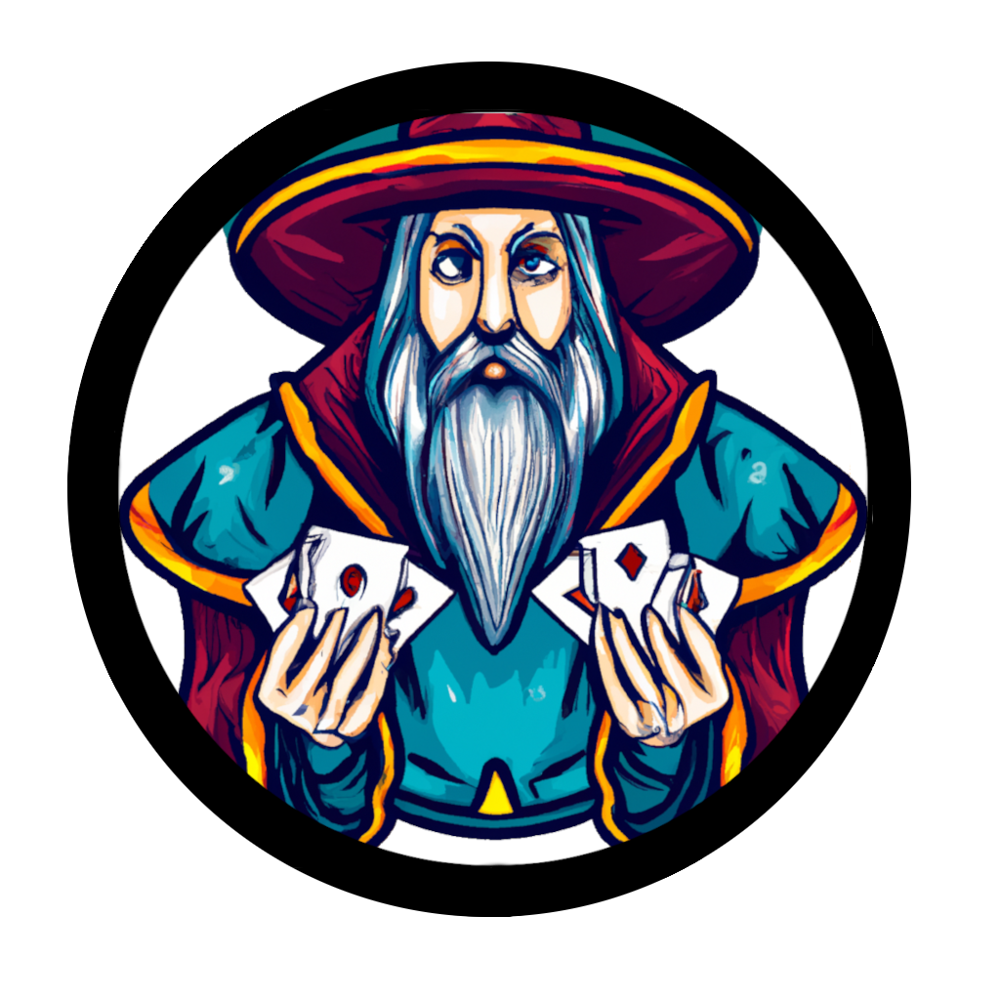
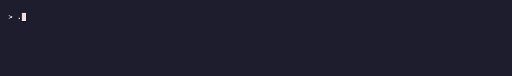
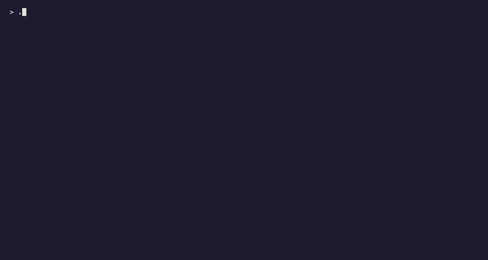
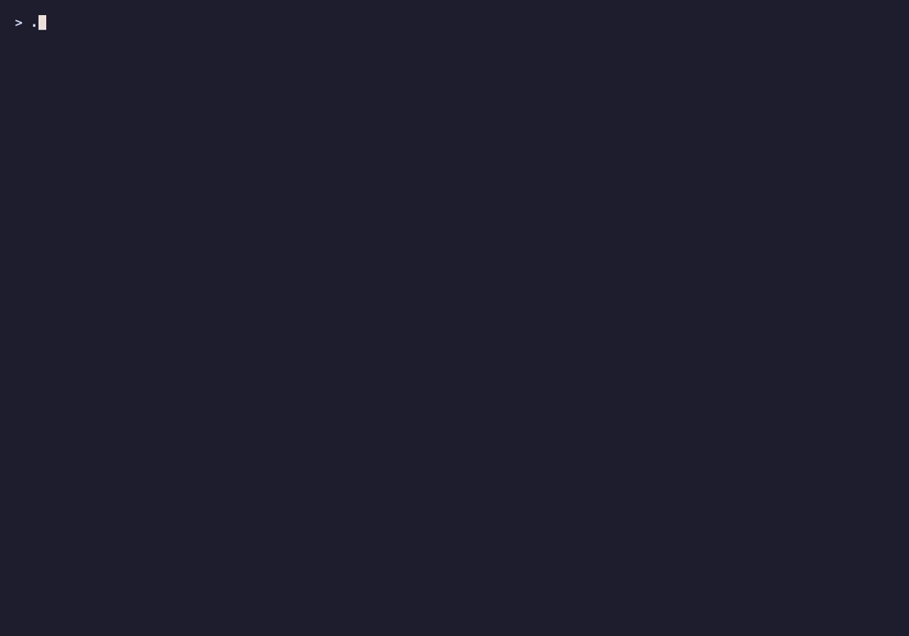
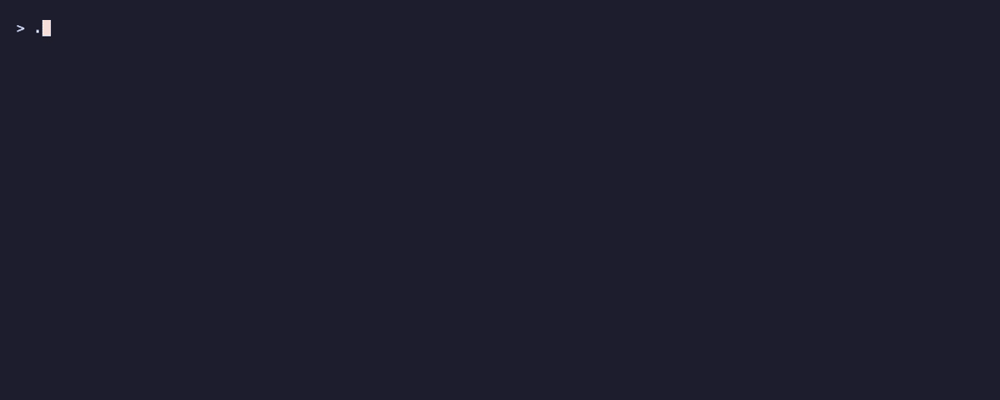
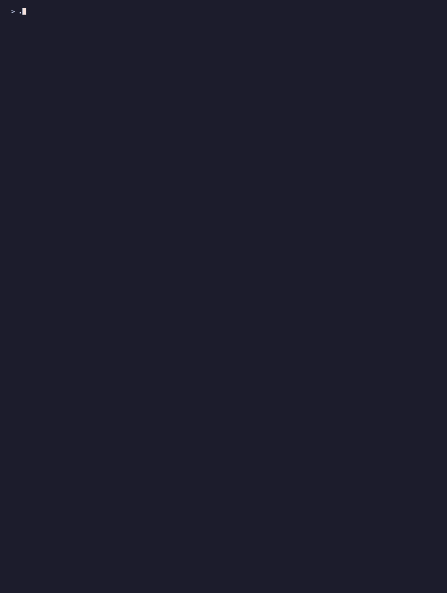
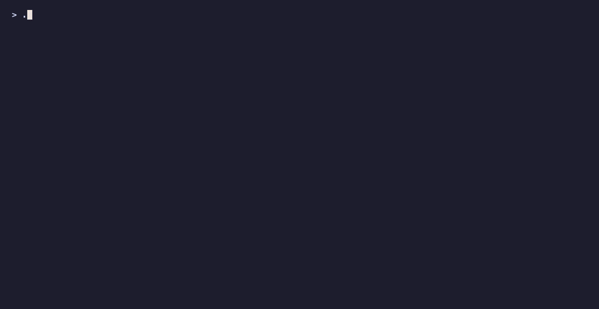
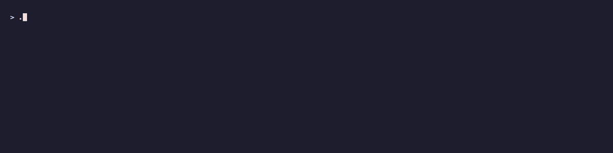
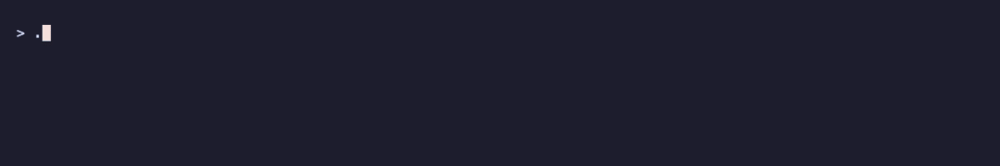

<div align="center">



# serra

**A fast, self-hosted *Magic: The Gathering* collection tracker for your terminal.**

Track what you own, what it's worth, and how its value moves — powered by
[Scryfall](https://scryfall.com), stored in [MongoDB](https://mongodb.com).

[](https://github.com/noqqe/serra/releases)
[](LICENSE)
[](go.mod)

</div>

---

Serra started as a holiday project in winter 2021/2022, out of frustration with
collection tracker websites that are a pain to use, want ~$10 a month, and
still don't have the features I want.

* 📈 **Price tracking** — full history per printing, owned or not
* 🔍 **Query & filter** your cards by set, color, rarity, type, legality, …
* 📊 **Statistics** over your whole collection
* 🚀 **Tops & flops** — what gained and lost the most value
* 🌐 **Tiny web UI** on top of the same data
* 🗂️ **Per-copy detail** — finish, language and condition tracked separately

> [!NOTE]
> Condition and language are stored as-is — serra does not validate them
> against a fixed enum.

## Quickstart

**1. Install**

```bash
brew install noqqe/tap/serra          # macOS
```

Linux/BSD/Windows binaries: [releases](https://github.com/noqqe/serra/releases).

**2. Spin up a database**

```bash
docker run -d -p 27017:27017 --name mongo mongo:8
```

(fine for trying it out — no persistent storage, so don't use it for real)

**3. Configure and go**

```bash
export MONGODB_URI='mongodb://localhost:27017'
export SERRA_CURRENCY=USD   # or EUR

./serra add usg/17
./serra update
```

The more cards you add, the more fun it gets.

## Commands

| Command | What it does |
| --- | --- |
| `add` | Add a card to your collection |
| `remove` | Remove a card from your collection |
| `card` | Search & show cards from your collection |
| `set` | Search & show sets from your collection |
| `check` | Check if a card is in your collection |
| `missing` | Display missing cards from a set |
| `stats` | Show statistics of the collection |
| `tops` / `flops` | What cards gained / lost the most value |
| `update` | Update card values from Scryfall |
| `migrate` | Bring the database up to the expected schema |
| `web` | Start the web interface |

Every command has `--help` with its flags.

### Bulk-adding cards

Yes, manually. Photo/OCR scanners guess editions wrong and struggle with
blue/black cards, so `add --interactive` turned out faster in practice — cards
are sorted by edition anyway, and it's just 2–3 digits and enter:

```
> ./serra add --interactive --unique --set one
one> 1
1x "Against All Odds" (uncommon, 0.06 USD) added to Collection.
one> 1
Not adding "Against All Odds" (uncommon, 0.06 USD) because it already exists.
one> 3-5
1x "Apostle of Invasion" (uncommon, 0.03 USD) added to Collection.
1x "Auramancer" (common, 0.02 USD) added to Collection.
1x "Battle Screech" (uncommon, 0.09 USD) added to Collection.
```

### How `update` works

`update` fetches the entire Scryfall bulk file and imports every printing into
the `cards` collection, appending a price snapshot — not just for cards you
own, so you can watch the price of something you're only thinking about
buying. It then refreshes each card you own, rolls that up into the set value,
and finally into the total collection value.

## Demo

Each gif is recorded from a [VHS](https://github.com/charmbracelet/vhs) tape
in [`vhs/`](vhs) against a small throwaway collection, so they can be
regenerated whenever the output changes — see [vhs/README.md](vhs/README.md).

<details>
<summary><b>Click to expand</b></summary>

**`add`** — add cards to your collection


**`remove`** — take them back out



**`card`** — query your cards with filters



**`set`** — list the sets you own cards from


**`set <code>`** — details of a single set



**`check`** — is this card already in the collection?


**`missing`** — what is still missing from a set



**`stats`** — statistics across your collection



**`tops`** — what gained the most value



**`flops`** — what lost the most value


**`update`** — refresh prices from Scryfall



**`migrate`** — bring the database up to the expected schema


**`web`** — start the web interface



</details>

## Note on AI Use

Most of 5.0.0 was written together with [Claude](https://claude.ai). This is a
hobby project I maintain in the evenings, and the honest reason is time: I have
a long list of changes I want in serra and no realistic chance of doing all of
them by hand. Pairing with an LLM is what got the schema split, the per-copy
language/condition tracking and a pile of long-standing bugfixes over the line
instead of sitting in my notes for another year. Or probably forever.

Up to version 4.x serra was completly written by myself. If you dont want to
use AI software, stay on that version. I want to be open and transparent about it.

## Documentation

* [UPGRADE.md](UPGRADE.md) — upgrading, schema versioning, migration notes
* [CHANGELOG.md](CHANGELOG.md) — notable changes per release

## Development

```bash
task build
./serra
```

`task build` bakes the version string in via `git describe`. A plain
`go build ./cmd/serra` works too, it just reports its version as `unknown`.

The gifs above are regenerated with `task gifs`, which seeds a throwaway
database and replays the tapes in [`vhs/`](vhs). Details in
[vhs/README.md](vhs/README.md).

---

<div align="center">
MIT licensed · built by <a href="https://github.com/noqqe">noqqe</a>
</div>
